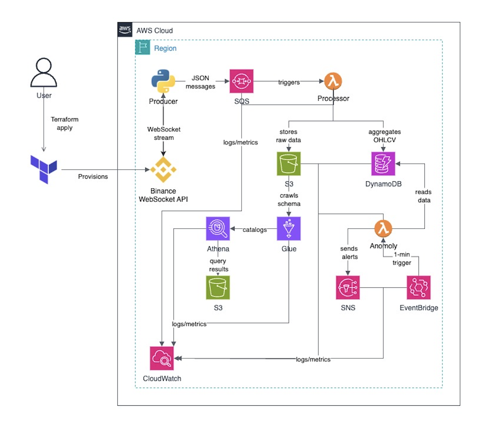

# BlockchainCore: Real-Time Blockchain Data Analytics on AWS

A comprehensive real-time data pipeline for ingesting, processing, and analyzing live cryptocurrency trade data using AWS services.

NOTE: Git commit history is gone since main branch was changed

## Architecture Overview



_Architecture diagram showing the complete data flow from Binance WebSocket to AWS services including SQS, Lambda functions, S3, DynamoDB, and monitoring components._

## 🗺️ Project Roadmap

| Component                      | Status         | Notes                                             |
| ------------------------------ | -------------- | ------------------------------------------------- |
| **Infrastructure (Terraform)** | ✅ Complete    | SQS, Lambda, DynamoDB, S3, EventBridge deployed   |
| **Data Producer**              | ✅ Complete    | Binance WebSocket → SQS streaming working         |
| **Data Processor**             | ✅ Complete    | SQS → OHLCV → DynamoDB/S3 processing              |
| **Anomaly Detection**          | ✅ Complete    | EventBridge → Lambda → SNS alerts                 |
| **Cost Optimization**          | ✅ Complete    | Migrated from Kinesis to SQS (~$13/month savings) |
| **Monitoring & Logging**       | ✅ Complete    | CloudWatch metrics and logs active                |
| **Frontend Dashboard**         | 🚧 In Progress | Real-time data visualization                      |
| **Multi-Symbol Support**       | 📋 Planned     | Add ETH, ADA, and other trading pairs             |
| **Advanced Analytics**         | 📋 Planned     | ML-based anomaly detection                        |
| **Mobile Alerts**              | 📋 Planned     | Push notifications for anomalies                  |

## Technology Choice: SQS + Lambda vs Alternatives

| Technology               | Monthly Cost (Baseline)    | Best For                                             | Trade-offs                             | Why We Chose SQS                          |
| ------------------------ | -------------------------- | ---------------------------------------------------- | -------------------------------------- | ----------------------------------------- |
| **Kinesis Data Streams** | ~$13-15 (fixed shard cost) | High-throughput, multiple consumers, strict ordering | Expensive idle cost, shard management  | Too expensive for our scale               |
| **SQS + Lambda** ✅      | ~$10-12 (pay-per-request)  | Single consumer, simple processing, cost-effective   | No replay capability, single consumer  | **Most cost-effective for our use case**  |
| **Kinesis Firehose**     | ~$1-3 (archival only)      | Direct S3 archival, Parquet conversion               | Sink-oriented, needs separate hot path | Good complement but not complete solution |

**Our Choice: SQS + Lambda**

- Eliminates fixed monthly costs (~$13/month savings)
- Perfect for single consumer pattern (processor → S3 + DynamoDB)
- Sub-second latency is sufficient for our needs
- Scales linearly with usage
- Simple operations and maintenance

## Features

- **Real-time Data Ingestion**: Live cryptocurrency trade data from Binance WebSocket API
- **Message Processing**: AWS SQS + Lambda for cost-effective, scalable data processing
- **Data Storage**:
  - Raw trade data in S3 (partitioned by date/hour)
  - Cleaned OHLCV data in DynamoDB
- **Data Analytics**: AWS Glue Catalog + Athena for historical data queries
- **Anomaly Detection**: Automated detection of price movements, volume spikes, and SMA divergences
- **Alerting**: SNS notifications for detected anomalies
- **Infrastructure as Code**: Terraform for AWS resource management
- **CI/CD**: GitHub Actions for automated deployments

## Prerequisites

- AWS CLI configured with appropriate permissions
- Terraform >= 1.0
- Python 3.9+
- Docker (for local development)
- GitHub repository with Actions enabled

## Quick Start

### 🚀 **Easy Management Scripts**

We've created convenient scripts to manage your infrastructure safely:

#### **1. Start Everything (Infrastructure + Producer)**

```bash
./scripts/start-infrastructure.sh
```

- ✅ **Deploys all AWS infrastructure**
- ✅ **Automatically starts the data producer**
- ✅ **Creates `.env` file with environment variables**
- ✅ **Shows important URLs and configuration**
- ✅ **Everything runs with one command!**

#### **2. Monitor Everything**

```bash
./scripts/monitor.sh
```

- Interactive dashboard for monitoring
- Check SQS, DynamoDB, S3, Lambda status
- View logs and cost estimates
- Real-time log following

#### **3. Stop Everything (SAFE SHUTDOWN)**

```bash
./scripts/stop-infrastructure.sh
```

- **Safely destroys all infrastructure**
- **Stops all costs immediately**
- **Requires confirmation to prevent accidents**
- **Complete cleanup including S3 bucket versions**

**Shutdown Options:**

- `yes` - Full cleanup (including S3 bucket)
- `fast` - Quick shutdown (skip S3 cleanup)
- `cancel` - Cancel operation

##### **Performance Comparison**

| Method            | Time             | S3 Cleanup           | Use Case           |
| ----------------- | ---------------- | -------------------- | ------------------ |
| **Fast Shutdown** | ~30 seconds      | Skipped              | Quick cost control |
| **Full Cleanup**  | Minutes to hours | Bulk deletion        | Complete cleanup   |
| **Old Method**    | Hours to days    | Individual deletions | Legacy approach    |

**Examples:**

```bash
# Fast shutdown (recommended for daily use)
echo "fast" | ./scripts/stop-infrastructure.sh

# Full cleanup (thorough cleanup)
echo "yes" | ./scripts/stop-infrastructure.sh

# Interactive (choose at runtime)
./scripts/stop-infrastructure.sh
```

### 📋 **Manual Steps (Alternative)**

If you prefer manual control:

1. **Clone and Setup**:

   ```bash
   git clone <repository-url>
   cd BlockchainCore
   pip install -r requirements.txt
   ```

2. **Configure AWS**:

   ```bash
   aws configure
   ```

3. **Deploy Infrastructure**:

   ```bash
   cd terraform
   terraform init
   terraform plan
   terraform apply
   ```

4. **Deploy Lambda Functions**:

   ```bash
   # This will be automated via GitHub Actions
   # or run manually:
   ./scripts/deploy-lambda.sh
   ```

5. **Start Data Producer**:
   ```bash
   python src/producer/main.py
   ```

## Configuration

### Environment Variables

- `BINANCE_WEBSOCKET_URL`: Binance WebSocket endpoint
- `SQS_QUEUE_URL`: AWS SQS queue URL for data processing
- `S3_BUCKET_NAME`: S3 bucket for raw data storage
- `DYNAMODB_TABLE_NAME`: DynamoDB table for OHLCV data
- `SNS_TOPIC_ARN`: SNS topic for alerts

### Anomaly Detection Parameters

- Price movement threshold: 5%
- Volume spike threshold: 3x average
- SMA divergence threshold: 2%
- Analysis window: 1 minute

## Monitoring

- **CloudWatch Metrics**: SQS queue depth, Lambda execution times, error rates
- **CloudWatch Logs**: Detailed logging for all Lambda functions
- **SNS Alerts**: Real-time notifications for anomalies and system issues

## Development

### Local Development

```bash
# Start local development environment
docker-compose up -d

# Run tests
pytest tests/

# Format code
black src/
isort src/
```

### Adding New Data Sources

1. Create a new producer in `src/producer/`
2. Update the SQS queue configuration
3. Modify the processor Lambda if needed
4. Update Terraform configuration

### Adding New Anomaly Detection Rules

1. Modify `src/lambda/anomaly/detector.py`
2. Add new detection logic
3. Update SNS notification format if needed
4. Deploy updated Lambda function

## Security

- IAM roles with least privilege access
- VPC configuration for Lambda functions
- KMS encryption for sensitive data
- CloudTrail logging for audit trails

## Cost Optimization

- S3 lifecycle policies for data retention
- DynamoDB on-demand billing
- Lambda function optimization
- CloudWatch log retention policies

## Troubleshooting

### Specific Issues & Solutions

1. **Producer Hanging on WebSocket Connection**

   - **Issue**: Producer hangs indefinitely when connecting to Binance WebSocket
   - **Solution**: Use `simple_producer.py` instead of complex async context managers
   - **Check**: Verify WebSocket connectivity with `test_websocket.py`

2. **DynamoDB Float Type Error**

   - **Issue**: Lambda fails with "Float types are not supported. Use Decimal types instead"
   - **Solution**: Convert all float values to Decimal using `Decimal(str(value))`
   - **Check**: Ensure processor Lambda uses Decimal types for OHLCV data

3. **SQS Queue Not Receiving Data**

   - **Issue**: Messages not appearing in SQS queue
   - **Solution**: Verify `SQS_QUEUE_URL` environment variable is set correctly
   - **Check**: Run `aws sqs get-queue-attributes` to see message counts

4. **Lambda Function Not Processing Messages**

   - **Issue**: SQS messages stuck in "NotVisible" state
   - **Solution**: Check Lambda function logs in CloudWatch
   - **Check**: Verify IAM permissions for SQS, S3, and DynamoDB access

5. **Producer WebSocket Connection Issues**

   - **Issue**: Cannot connect to Binance WebSocket
   - **Solution**: Test with `minimal_test.py` to isolate network issues
   - **Check**: Ensure no firewall blocking WebSocket connections

6. **Script Files Missing or Deleted**

   - **Issue**: Script files accidentally deleted during development
   - **Solution**: Recreate scripts with improved organization and functionality
   - **Check**: Verify all scripts exist in `scripts/` and `scripts/subscripts/` directories

7. **Start Script Producer Path Error**

   - **Issue**: `./scripts/subscripts/start-producer.sh: No such file or directory`
   - **Solution**: Ensure all subscripts are created and executable
   - **Check**: Run `chmod +x scripts/subscripts/*.sh` to make scripts executable

8. **Python Environment Mismatch in Scripts**

   - **Issue**: Scripts using `python3` instead of `python` (Anaconda environment)
   - **Solution**: Update scripts to use correct Python interpreter
   - **Check**: Verify `which python` points to correct environment with required packages

9. **S3 Bucket Cleanup Taking Too Long**
   - **Issue**: Shutdown script hanging on S3 bucket cleanup with many versions
   - **Solution**: Use fast shutdown option or add `force_destroy = true` to S3 bucket
   - **Check**: Terraform configuration includes `force_destroy = true` for S3 bucket

## Contributing

1. Fork the repository
2. Create a feature branch
3. Make your changes
4. Add tests
5. Submit a pull request

## License

MIT License - see LICENSE file for details.

## Support

For issues and questions:

- Create a GitHub issue
- Check the troubleshooting section
- Review CloudWatch logs for detailed error information
